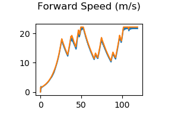
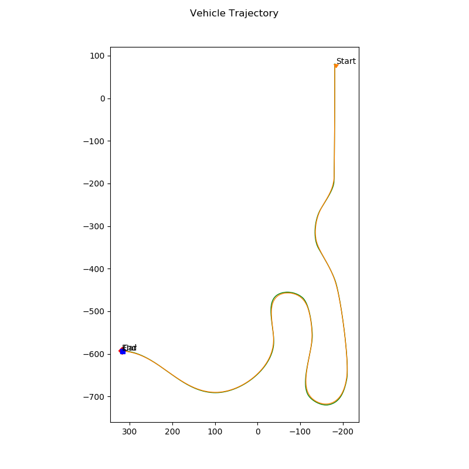

# Racetrack Vehicle Navigation
Self-Driving Vehicle Control Project

<p align="center">

</p>

The goal is to control the vehicle to follow a race track by navigating through preset waypoints. The task involves:
 1. Implementing PID controller.
 2. Implement longitudinal and lateral controllers.

## Project Directory:
The project directory should be similar to:
```
├── controller_output 		# contains output files [forward speed, trajectory feedback]
│   ├── ...
│── video 					# stores video output from project                   
│   ├── ...
├── controller2d 			# contains implementation of longitudinal, lateral, and pid controllers
├── cutils							
├── module_7 				# main program
├── options.cfg 					
├── racetrack_wapoints.txt 	# contains reference trackpoints
├── Readme.md
```

## Results
The `controller2d.py` file contains code for longitudinal, lateral, and PID controllers. Upon completion, a CARLA simulation is executed, and output files including:
 1. Speed Tracking.
 2. Steering Output.
 3. Vehicle Trajectory.

Success is dependent on how similar the simulated waypoints data compares to the preset points. For speed tracking we can see an overlap between the desired (yellow) and simulated speed (blue). 
<p align="center">

</p>

The vehicle trajectory also shows strong correlation between the desired (yellow) and recorded waypoints (green).
<p align="center">

</p>

Due to the strong correlation, we can consider the PID controller sufficient for this project. Alternatively, an error state extended Kalman filter could have been implemented.